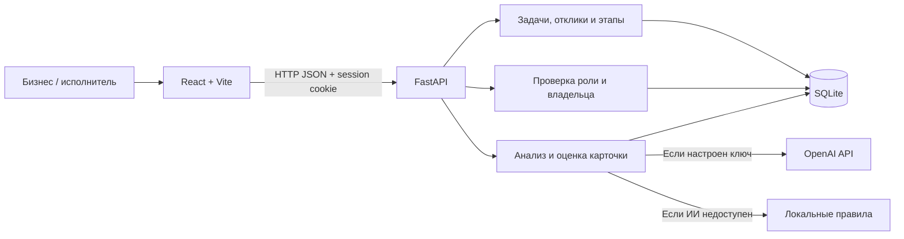

# Alem Challenge Hub

**Платформа, которая помогает бизнесу сформулировать практическую задачу, а исполнителям — найти проект и предложить решение.**

Проект команды **Power of Oil&Gas** для HackAlem / AI SANA. ИИ уточняет исходную идею и оценивает качество постановки задачи. Бизнес проверяет сведения, публикует карточку, выбирает исполнителей и оценивает выполненные этапы.

> Текущая версия — хакатонный MVP. Сквозной сценарий доступен локально, в том числе без ключа OpenAI: в этом случае приложение явно показывает работу по локальным правилам.

## Содержание

1. [Проблема и пользователи](#1-проблема-и-пользователи)
2. [Что реализовано](#2-что-реализовано)
3. [Как работает решение](#3-как-работает-решение)
4. [Рейтинги и оценка результатов](#4-рейтинги-и-оценка-результатов)
5. [Технологии](#5-технологии)
6. [Архитектура](#6-архитектура)
7. [Установка и запуск](#7-установка-и-запуск)
8. [Как проверить решение](#8-как-проверить-решение)
9. [Данные и интеграции](#9-данные-и-интеграции)
10. [Ограничения текущей версии](#10-ограничения-текущей-версии)
11. [Развёрнутая версия](#11-развёрнутая-версия)

## 1. Проблема и пользователи

Исходная идея бизнеса часто не содержит сведений, необходимых для начала работы: доступных данных, ожидаемого результата, ограничений и критериев приёмки. Исполнителю сложно оценить такую задачу и подготовить предметное предложение.

Alem Challenge Hub помогает превратить свободное описание в структурированную карточку и показывает, что ещё нужно уточнить.

| Пользователь | Возможности |
|---|---|
| Представитель бизнеса | Создаёт и видит только свои задачи, уточняет требования с ИИ, публикует карточки, рассматривает отклики и выставляет оценки за этапы. |
| Исполнитель / студенческая команда | Просматривает опубликованные задачи, предлагает идею и план, отслеживает собственные отклики и полученные оценки. |

Исполнитель регистрирует один аккаунт со своим именем или названием команды. Совместное управление командой несколькими участниками не реализовано.

## 2. Что реализовано

- **Регистрация и вход с двумя ролями.** Владение задачами и права на действия проверяются сервером. Пароли хранятся в виде PBKDF2-хешей; вход поддерживается сессионной HttpOnly-cookie.
- **Пошаговое уточнение задачи.** Помощник выделяет сведения из описания и задаёт минимум три вопроса, связанных с конкретными полями. У вопросов есть подсказки и объяснение их назначения.
- **Редактор карточки и объяснимый рейтинг.** Отдельно показываются предварительный локальный расчёт и результат проверки с ИИ, критерии, цитаты и рекомендации.
- **Подтверждение перед публикацией.** Бизнес проверяет сведения вручную. После изменения карточки перед подтверждением нужна новая оценка.
- **Каталог.** Поиск, фильтры по отрасли и готовности, сортировка по рейтингу. Низкий балл не запрещает публикацию и отклики.
- **Отклики и выбор исполнителей.** Идея решения, план, срок и ссылка на прототип или репозиторий. Бизнес может выбрать несколько исполнителей или отклонить предложения.
- **Оценка этапов.** Бизнес вводит фактический балл, обоснование и подтверждает результат. Максимум не начисляется автоматически.
- **Репутация претендента.** В списке предложений отображаются средний рейтинг по другим завершённым заданиям и размер этой истории.
- **Счётчик претендентов.** На карточке задачи виден счётчик уникальных претендентов; для бизнеса он ведёт к откликам.
- **Русский, казахский и английский интерфейс**, светлая и тёмная темы. Настройки сохраняются между посещениями; смена языка не очищает заполненную форму.
- **Демонстрационные данные, документация API и автоматические backend-тесты.**

## 3. Как работает решение

1. **Описание.** Бизнес вводит задачу обычным текстом или использует один из пяти учебных примеров.
2. **Уточнение.** При включённом OpenAI модель извлекает сведения и предлагает вопросы. Сервер принимает извлечённый текст только при наличии дословной цитаты в исходном описании. Без доступного ИИ используются локальные правила и шаблоны вопросов.
3. **Карточка.** Бизнес отвечает минимум на три вопроса. Ответы переносятся в соответствующие поля дословно, без дополнительного пересказа моделью. Неизвестные сведения можно оставить неуказанными.
4. **Оценка.** Кнопка «Оценить с ИИ» запускает отдельную содержательную проверку. Модель возвращает доказательства выполнения критериев, а сервер проверяет цитаты и суммирует фиксированные веса.
5. **Публикация.** Бизнес подтверждает сведения и отдельно публикует задачу. Она появляется у исполнителей.
6. **Отклик.** Исполнитель отправляет предложение. Бизнес сравнивает подходы и историю оценок, затем принимает решение.
7. **Результат.** Бизнес проверяет работу и выставляет баллы за этапы. Исполнитель видит оценки в своих откликах.

ИИ не выбирает исполнителей, не публикует задачи и не принимает результаты вместо бизнеса.

## 4. Рейтинги и оценка результатов

В приложении используются **три разных показателя**.

### Качество постановки задачи: 0–100

| Раздел карточки | Максимум |
|---|---:|
| Контекст | 10 |
| Потребность | 10 |
| Данные и материалы | 20 |
| Ожидаемый результат | 15 |
| Критерии успеха | 15 |
| Ограничения | 10 |
| Пользователи | 10 |
| Контакт | 5 |
| Формат взаимодействия | 5 |
| **Всего** | **100** |

Каждый раздел разбит на критерии: одно заполненное поле не получает весь максимум. Например, в данных отдельно оцениваются источник — 6, формат — 4, объём/период — 5 и условия доступа — 5 баллов. Название обязательно для подтверждения, но баллов не приносит.

Уровни: **0–39 — «Черновик»**, **40–69 — «Рабочая»**, **70–89 — «Готовая»**, **90–100 — «Приоритетная»**. Уровень «Черновик» не означает, что запись обязательно скрыта: статус публикации хранится отдельно.

Во время ввода показывается предварительный расчёт по локальным признакам текста. Оценка ИИ становится официальной после подтверждения бизнесом. При недоступности модели можно подтвердить явно обозначенную локальную оценку. Повторный запрос для неизменённой карточки использует сохранённый ответ ИИ; проверяется соответствие оценки тексту и версии рубрики.

### Баллы исполнителя за конкретное задание: 0–100

| Этап | Допустимая оценка |
|---|---:|
| Исследование | 0–20 |
| Прототип | 0–30 |
| Проверка результата | 0–50 |

Бизнес вводит целое число вручную. Обязательны описание проверенного результата и подтверждение. Ноль допустим; повторное начисление за один этап блокируется. Эти баллы не изменяют рейтинг постановки задачи.

### Средний рейтинг претендента

Среднее арифметическое суммарных баллов по **другим завершённым заданиям**, где исполнитель выбран и оценены все три этапа. Текущее задание и неполная история этапов исключаются. При нескольких завершённых откликах на одну задачу учитывается последний. Без истории показывается «Пока нет оценок», а не нулевой рейтинг.

Счётчик претендентов считает уникальных подавших отклик, включая уже рассмотренные предложения. Повторные отклики одного исполнителя его не увеличивают.

## 5. Технологии

Версии указаны по файлам зависимостей репозитория.

| Компонент | Технологии |
|---|---|
| Интерфейс | JavaScript / JSX, React 19.3.0, React Router DOM 7.18.4, CSS |
| Сборка и разработка | Vite 8.3.0, `@vitejs/plugin-react` 6.1.1, npm |
| Иконки | `lucide-react` 1.47.0, собственный SVG favicon |
| Сервер | Python, FastAPI 0.141.1, Uvicorn 0.53.0 |
| Валидация и настройки | Pydantic 2.13.5, python-dotenv 1.2.3 |
| Хранение | SQLite через стандартный модуль `sqlite3` |
| ИИ | OpenAI API, Python SDK `openai` 3.19.0, модель по умолчанию `gpt-5-mini` |
| Формат ответа ИИ | Chat Completions со строгой JSON Schema |
| Проверки | `unittest`, FastAPI TestClient, HTTPX 0.28.1 |
| Локализация | Собственный общий JSON-словарь для frontend и backend |

В зависимостях также указан TypeScript 7.0.2, однако текущий интерфейс написан в `.js` и `.jsx`. Названия технологий в учебных профилях команд не являются зависимостями приложения.

## 6. Архитектура



```text
backend/
  app/
    main.py                   # API, CORS, защита запросов, инициализация
    config.py                 # Переменные окружения
    database.py               # SQLite и совместимые изменения схемы
    schemas.py                # Валидация входных данных
    i18n.py                   # Язык текущего запроса
    routers/
      auth.py                 # Регистрация, вход, сессии и роли
      challenges.py           # Создание, оценка, публикация, каталог
      proposals.py            # Отклики, репутация, решения и этапы
    services/
      ai_service.py           # Извлечение сведений, вопросы, сборка карточки
      rating_service.py       # Рубрика, проверка доказательств, расчёт
      seed_service.py         # Учебные записи
  tests/test_workflow.py      # Автоматические проверки
  requirements.txt
  requirements-dev.txt
frontend/
  src/
    pages/                    # Экраны двух ролей
    components/               # Карточки, рейтинг, общая навигация
    auth/                     # Состояние входа и защита маршрутов
    api/client.js             # HTTP-клиент
    i18n.js                   # Переключение языка и темы
    styles.css
  public/favicon.svg
shared/
  translations.json          # Переводы интерфейса и подсказок
  questions.json             # Вопросы для локализованного отображения
```

SQLite хранит пользователей, сессии, задачи, оценки карточек, отклики, этапы и учебные профили команд. Черновик редактора дополнительно сохраняется в `sessionStorage` вкладки, язык и тема — в `localStorage`.

Ключ OpenAI используется только backend. При включённом ИИ сервер передаёт ему текст описания или карточки. Frontend отправляет `Accept-Language`, сессионную cookie и заголовок `X-Requested-With: Alem`; изменяющие запросы также проходят проверку браузерного Origin.

## 7. Установка и запуск

### Требования

- Git, Python 3.11+ и npm.
- Node.js 22.12+; ограничение Vite в lock-файле — `^20.19.0 || >=22.12.0`.
- Интернет для первоначальной установки зависимостей и для запросов к OpenAI.
- Для режима ИИ — собственный API-ключ с доступом к настроенной модели. Для локального сценария ключ не нужен.

### Получение проекта

```sh
git clone https://github.com/BAITC-Hacks/hack-a00ee6a5-power-of-oil-gas.git
cd hack-a00ee6a5-power-of-oil-gas
```

### Быстрый запуск на Windows

В **командной строке CMD**, из корня проекта:

```bat
start_project.bat
```

Скрипт откроет два окна, создаст Python-окружение при необходимости, установит зависимости backend, установит frontend-зависимости при отсутствии `node_modules` и создаст отсутствующие `.env` из примеров.

- Приложение: [localhost:5173](http://localhost:5173/).
- Документация API: [localhost:8000/docs](http://localhost:8000/docs).
- Проверка сервера: [localhost:8000/api/health](http://localhost:8000/api/health), ожидаемый ответ — `{"status":"ok"}`.

Если порты заняты, задайте другие — **сначала backend, затем frontend**:

```bat
start_project.bat 8001 5174
```

Тогда интерфейс будет на [localhost:5174](http://localhost:5174/), API — на [localhost:8001/docs](http://localhost:8001/docs). Скрипты согласуют адрес API и CORS. Из PowerShell эти команды запускаются с префиксом `.\`.

### Настройка ИИ

Параметры находятся в `backend/.env`; шаблон — [backend/.env.example](backend/.env.example):

```env
OPENAI_API_KEY=
OPENAI_MODEL=gpt-5-mini
USE_AI=true
FRONTEND_ORIGIN=http://localhost:5173
DATABASE_PATH=./data/ai_sana.db
```

Для ИИ заполните `OPENAI_API_KEY` своим ключом и перезапустите backend. Для гарантированного локального режима установите `USE_AI=false`. Пустой ключ, ошибка API или некорректный ответ модели также приводят к явно обозначенному резервному режиму.

Запрос к модели ограничен 55 секундами, автоматические повторы отключены. Переменная `OPENAI_MODEL` позволяет изменить модель; её совместимость с используемой JSON Schema необходимо проверить отдельно.

Параметр frontend в `frontend/.env`:

```env
VITE_API_URL=http://localhost:8000/api
```

Не помещайте API-ключ в frontend. Файлы `.env`, локальная база и файл первоначальных паролей исключены из Git. Не перезаписывайте существующий `.env` при повторной настройке.

### Ручной запуск на Windows

Первый терминал CMD, из корня проекта:

```bat
cd backend
python -m venv .venv
.venv\Scripts\python.exe -m pip install -r requirements.txt
if not exist .env copy .env.example .env
.venv\Scripts\python.exe -m uvicorn app.main:app --reload --host 127.0.0.1 --port 8000
```

Второй терминал CMD, из корня проекта:

```bat
cd frontend
npm ci
if not exist .env copy .env.example .env
npm run dev -- --port 5173 --strictPort
```

Для macOS/Linux в первом терминале:

```sh
cd backend
python3 -m venv .venv
.venv/bin/python -m pip install -r requirements.txt
[ -f .env ] || cp .env.example .env
.venv/bin/python -m uvicorn app.main:app --reload --host 127.0.0.1 --port 8000
```

Во втором терминале:

```sh
cd frontend
npm ci
[ -f .env ] || cp .env.example .env
npm run dev -- --port 5173 --strictPort
```

При ручной смене портов обновите `FRONTEND_ORIGIN` в backend и `VITE_API_URL` во frontend. Используйте один hostname, например `localhost`, для обоих адресов.

### Первый вход и учебные данные

База создаётся автоматически. При пустых соответствующих таблицах добавляются пять учебных задач, пять профилей команд и пять предложений. Это синтетические записи, а не реальные заказчики или результаты работы.

Создайте собственные бизнес-аккаунт и аккаунт исполнителя через «Создать аккаунт». Новый бизнес-аккаунт изначально не имеет задач; исполнитель видит опубликованный каталог.

Учебные и прежние записи без владельца привязываются к `owner@alem.local` и `team@alem.local`. Сгенерированные при создании этих аккаунтов пароли записываются рядом с базой в `initial-access.txt` — по умолчанию `backend/data/initial-access.txt`. Общего публичного пароля нет. Для проверки основного сценария эти аккаунты не требуются.

## 8. Как проверить решение

### Повторяемый сценарий для жюри

Ниже — **учебные входные данные**, не утверждение о наличии реального HR-заказчика или документов.

**Шаг 1. Создать задачу от бизнеса.** Зарегистрируйтесь с ролью бизнеса. Укажите отрасль HR и описание:

> Новые сотрудники долго ищут инструкции и часто задают HR одинаковые вопросы. Нужен прототип помощника, который отвечает по согласованным документам, показывает источник и сообщает, если ответа нет.

Ответьте минимум на три предложенных вопроса и откройте редактор. Порядок вопросов может различаться. Для карточки используйте:

| Поле | Учебное значение |
|---|---|
| Название | `[Демо жюри] HR-помощник по адаптации` |
| Контекст | Сейчас HR вручную отвечает на повторяющиеся вопросы 10 новых сотрудников в месяц; поиск инструкций занимает время. |
| Потребность | Упростить поиск инструкций и сократить время HR на повторяющиеся ответы. |
| Пользователи | Новый сотрудник задаёт вопрос во время адаптации и открывает документ-источник; HR проверяет спорные ответы. |
| Данные и материалы | Учебный набор из 20 документов PDF и DOCX и 50 тестовых вопросов. Куратор передаёт обезличенные материалы через закрытую папку в начале проекта. |
| Ожидаемый результат | Прототип веб-чата с ответами и ссылками на источники, загрузкой документов для HR, исходным кодом и инструкцией локального запуска в репозитории. |
| Критерии успеха | На 50 заранее согласованных вопросах минимум 40 ответов соответствуют эталону HR. Проверочные вопросы не используются для настройки. При отсутствии сведений помощник сообщает об этом. |
| Ограничения | Четыре недели, Python и локальный запуск. Только учебные документы без персональных данных; передача внутренних документов внешним сервисам требует согласования. |
| Контакт | Ответственный — учебный HR-куратор; демонстрационный адрес `hr@example.com`. |
| Формат взаимодействия | Два онлайн-созвона в неделю. Куратор проверяет демонстрации и подтверждает этапы в приложении. |

**Шаг 2. Проверить оценку и публикацию.** Нажмите «Оценить с ИИ». С ключом ожидается метка смысловой оценки ИИ; без ключа — явное сообщение о локальном расчёте. Раскройте критерии: у каждого есть вес и основание начисления. Конкретный балл заранее не фиксирован. Подтвердите сведения и опубликуйте задачу.

**Шаг 3. Отправить отклик.** Выйдите и зарегистрируйте исполнителя. Найдите задачу с точным демо-названием и заполните:

- Идея: «Соберём прототип чата с ответами по учебной базе и показом источников».
- План: «Изучим материалы, подготовим прототип, проверим ответы на согласованном наборе вопросов».
- Срок: «4 недели».
- Ссылка: для проверки формата можно использовать [репозиторий этого проекта](https://github.com/BAITC-Hacks/hack-a00ee6a5-power-of-oil-gas); это учебная ссылка, а не готовый HR-прототип.

После отправки отклик появится в «Моих откликах» со статусом «На рассмотрении».

**Шаг 4. Рассмотреть предложение и оценить этапы.** Войдите в тот бизнес-аккаунт, который создал демо-задачу. На карточке появится один претендент. Перейдите по счётчику к предложениям и выберите исполнителя. У нового аккаунта будет «Пока нет оценок».

Для демонстрации выставьте исследованию **12/20**, в обосновании напишите «Учебная проверка: часть материалов исследована, выявлены пробелы» и подтвердите. Прогресс должен стать **12**, а не 20. Попытка повторно начислить баллы за тот же этап блокируется.

**Шаг 5. Проверить репутацию.** В том же учебном сценарии оцените прототип в **24/30**, проверку результата — в **40/50**, каждый раз указав учебное обоснование. Итог задания — **76/100**. Создайте вторую задачу и отправьте отклик тем же исполнителем: в её списке претендентов ожидается средний рейтинг **76/100 по одному завершённому заданию**. В исходной задаче её собственная оценка в прошлую историю не входит.

**Шаг 6. Проверить интерфейс и права.** Переключите ҚАЗ / РУС / ENG и тему, обновите страницу. Настройки должны сохраниться. Второй бизнес-аккаунт не должен видеть или изменять чужие задачи. Для параллельной проверки ролей используйте разные браузерные профили: обычные вкладки одного профиля разделяют сессию.

### Автоматические проверки

Из корня проекта, Windows CMD:

```bat
cd backend
.venv\Scripts\python.exe -m pip install -r requirements-dev.txt
.venv\Scripts\python.exe -m unittest discover -s tests -v
```

Для macOS/Linux замените `.venv\Scripts\python.exe` на `.venv/bin/python`.

В [test_workflow.py](backend/tests/test_workflow.py) определены **18 тестов**: роли и владение задачами, регистрация и выход, сквозной сценарий, частичные оценки и их границы, повторные начисления, репутация, уникальные претенденты, локализация, недостоверные цитаты, резервный режим и соответствие оценки версии карточки. Проверки используют временную SQLite-базу, отключают реальные обращения к OpenAI и подставляют ответы модели там, где это требуется. Они не доказывают качество ответов реальной модели.

Проверка сборки frontend, из корня проекта:

```sh
cd frontend
npm ci
npm run build
```

Результат находится в `frontend/dist`. Эта команда собирает интерфейс, но не развёртывает приложение и не запускает backend.

## 9. Данные и интеграции

| Источник / интеграция | Что используется |
|---|---|
| Ввод бизнеса | Текст идеи, ответы на вопросы, поля карточки и подтверждения. |
| Ввод исполнителя | Идея решения, план, срок, HTTP(S)-ссылка. Ссылка сохраняется; её содержимое автоматически не анализируется. |
| Оценки бизнеса | Баллы, текст обоснования и подтверждение этапов. |
| Учебные записи | Синтетические задачи и команды из `seed_service.py`, примеры описаний из формы создания. |
| OpenAI API | Извлечение сведений, вопросы, проверка критериев и пояснения. Модель по умолчанию — `gpt-5-mini`; своей обученной модели в репозитории нет. |
| SQLite | Локальное хранение записей приложения. |

**Приложение принимает текстовые описания материалов.** Упоминание PDF, DOCX, CSV, камер или базы документов в карточке описывает ресурсы будущего задания. Загрузка и обработка этих файлов, видеопотоков или корпоративных баз самой платформой не реализованы. Интеграций с HR-системами, почтой, мессенджерами и GitHub API нет; GitHub-ссылка в отклике — обычная ссылка.

Описание задачи и поля карточки передаются OpenAI только в режиме ИИ. Для демонстрации можно использовать синтетические сведения и полностью локальный режим. Пользовательские тексты и цитаты при смене языка интерфейса не переводятся автоматически.

Подробнее об обработке ИИ: [docs/AI_CONTRACT.md](docs/AI_CONTRACT.md).

## 10. Ограничения текущей версии

- **MVP для локальной демонстрации.** Нет конфигурации промышленного развёртывания, нагрузочных тестов или подтверждённых показателей работы с реальными заказчиками.
- **ИИ не проверяет истинность фактов.** Проверка дословной цитаты не гарантирует правильную смысловую интерпретацию. Итоговые сведения проверяет бизнес; локальный расчёт опирается на признаки текста и не равнозначен LLM-оценке.
- **Зависимость от внешнего API.** Режим ИИ требует доступа к модели и сети, расходует API-квоту; при отказе включается резервный расчёт. Автоматические тесты не измеряют качество реальных ответов модели.
- **Нет восстановления пароля, подтверждения email, ограничения попыток входа и административной панели.** Для публичной эксплуатации необходимо отдельно организовать HTTPS и эксплуатационную защиту.
- **Нет файлового хранилища, RAG-поиска по корпоративным документам и обработки отраслевых данных.** Платформа помогает поставить задачу исполнителю, а не выполняет описанный в ней проект.
- **Ограниченное управление работой.** Нет встроенного чата, уведомлений, многопользовательских команд и полноценного проектного трекера. Повторные отклики разрешены; отдельного действия отзыва отклика нет.
- **Оценки этапов однократные.** Редактирование уже подтверждённой оценки через интерфейс не реализовано. Репутация основана на выставленных бизнесом баллах и не является независимой проверкой квалификации.
- **Локальные черновики привязаны к вкладке.** Совместное редактирование и разрешение конфликтов не реализованы. Списки обновляются при загрузке и возвращении во вкладку, без realtime-соединения.
- **Учебная база не является подтверждением внедрения.** Примеры команд, проектов и ссылок не следует представлять как реальных клиентов или достигнутые бизнес-результаты.

## 11. Развёрнутая версия

**В текущем репозитории не указана подтверждённая ссылка на публично развёрнутое приложение.**

Для проверки используйте локальный запуск: [http://localhost:5173](http://localhost:5173/) либо [http://localhost:5174](http://localhost:5174/) при запуске `start_project.bat 8001 5174`. Эти адреса доступны на компьютере с запущенным проектом и не являются публичным деплоем.

Исходный код: [BAITC-Hacks/hack-a00ee6a5-power-of-oil-gas](https://github.com/BAITC-Hacks/hack-a00ee6a5-power-of-oil-gas).
